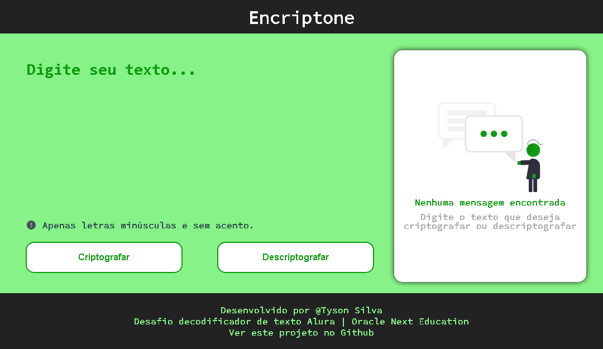

# Decodificador de texto

Desafio de Lógica de Programação - Alura | Oracle Next Education

[Clique aqui para ver minha implementação](https://tysonos.github.io/decodificador-de-texto-challenge-one/)



## Descrição do desafio

Uma aplicação que criptografa textos, assim você poderá trocar mensagens secretas com outras pessoas que saibam o segredo da criptografia utilizada.

As "chaves" de criptografia que utilizaremos são:

```
    A letra "e" é convertida para "enter"
    A letra "i" é convertida para "imes"
    A letra "a" é convertida para "ai"
    A letra "o" é convertida para "ober"
    A letra "u" é convertida para "ufat"
```

**Requisitos:**

- [x] Deve funcionar apenas com letras minúsculas
- [x] Não devem ser utilizados letras com acentos nem caracteres especiais
- [x] Deve ser possível converter uma palavra para a versão criptografada e também retornar uma palavra criptografada para a versão original.
- [x] A página deve ter campos para inserção do texto a ser criptografado ou descriptografado, e a pessoa usuária deve poder escolher entre as duas opções
- [x] O resultado deve ser exibido na tela.
